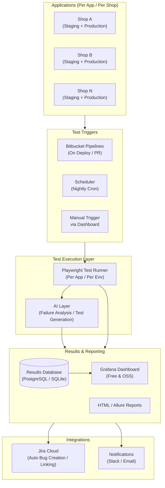
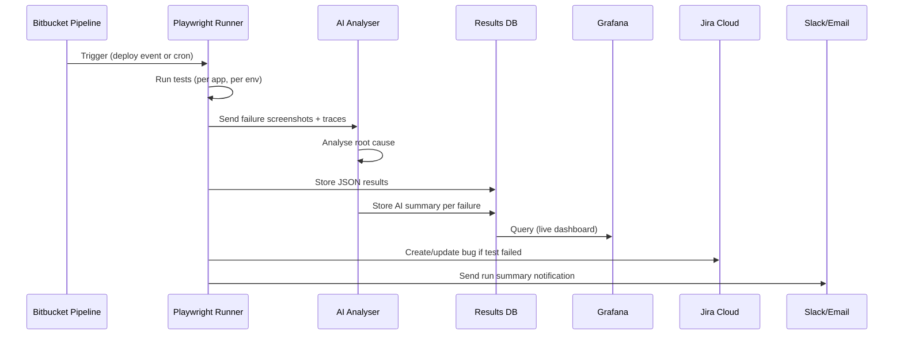
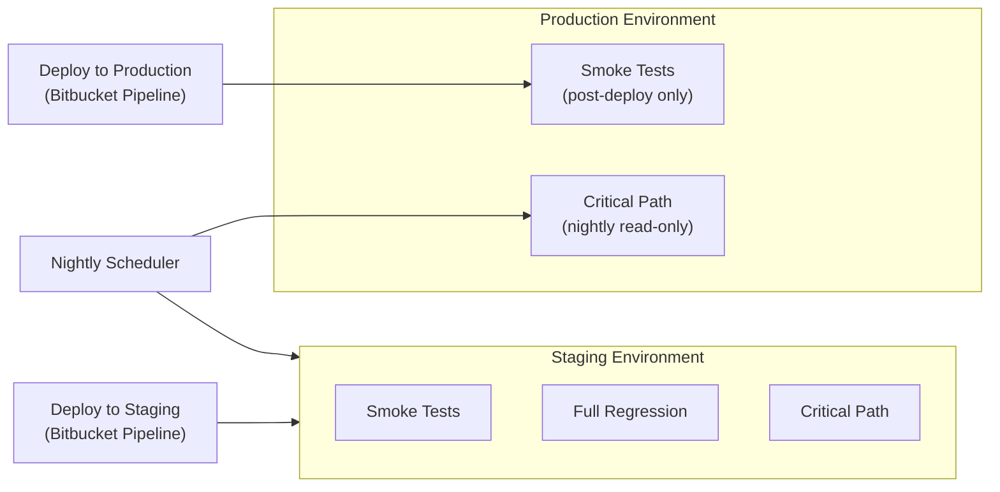
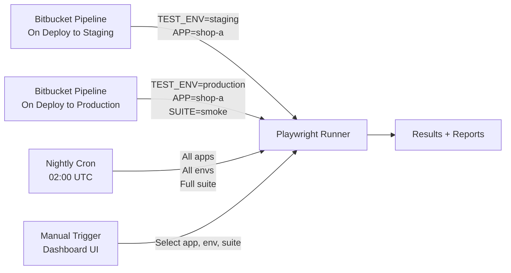
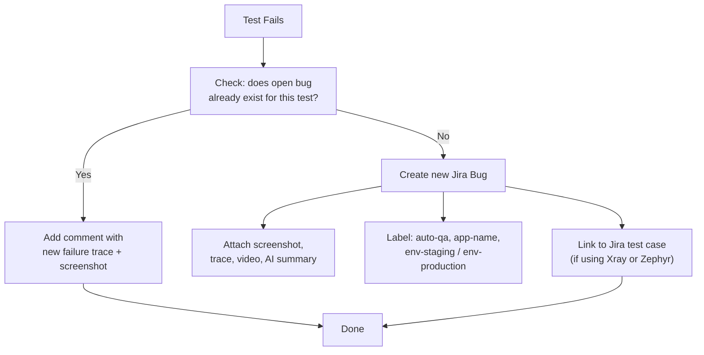
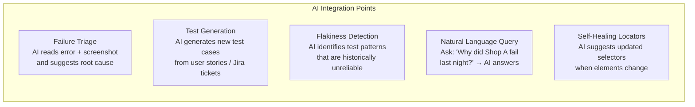
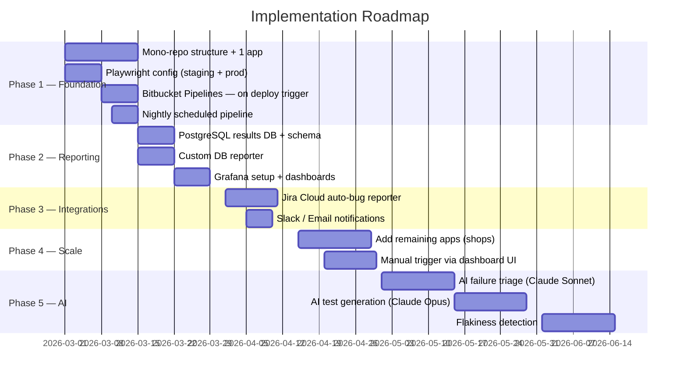

# QA Automation Platform Plan
> **Playwright + AI + Dashboard + Jira + Bitbucket Pipelines**  
> Multi-app, multi-environment test automation platform — Staging & Production

---

## Table of Contents

1. [Vision & Goals](#1-vision--goals)
2. [High-Level Architecture](#2-high-level-architecture)
3. [Platform Components](#3-platform-components)
4. [Per-App / Per-Shop Structure](#4-per-app--per-shop-structure)
5. [Environment Strategy — Staging vs Production](#5-environment-strategy--staging-vs-production)
6. [Test Execution Triggers](#6-test-execution-triggers)
7. [Bitbucket Pipelines Integration](#7-bitbucket-pipelines-integration)
8. [Jira Cloud Integration](#8-jira-cloud-integration)
9. [Dashboard — Options Compared](#9-dashboard--options-compared)
10. [Nightly Scheduled Execution](#10-nightly-scheduled-execution)
11. [AI Integration Points](#11-ai-integration-points)
12. [Tech Stack Summary](#12-tech-stack-summary)
13. [Phased Roadmap](#13-phased-roadmap)
14. [Open Questions & Decisions](#14-open-questions--decisions)

---

## 1. Vision & Goals

| Goal | Description |
|---|---|
| **Multi-app coverage** | Each shop/app has its own test suite, config, and results |
| **Dual-environment** | Tests run against both Staging and Production independently |
| **Automated triggers** | Tests fire on every deployment via Bitbucket Pipelines |
| **Scheduled execution** | Nightly full regression runs on all apps and environments |
| **Centralised visibility** | One dashboard showing all apps, all envs, pass/fail trends |
| **Jira integration** | Failures auto-create or link Jira bugs with context |
| **AI-assisted QA** | AI helps with failure triage, test generation, flakiness detection |
| **Low/no cost tooling** | Prefer open-source (Grafana, Playwright) where possible |

---

## 2. High-Level Architecture



---

## 3. Platform Components

### 3.1 Core Components

| Component | Role | Tooling |
|---|---|---|
| **Test Runner** | Execute Playwright tests per app, per env | Playwright |
| **Test Reporter** | Persist results, generate HTML/JSON reports | Playwright built-in, Allure |
| **Results Store** | Store historical run data for trends | PostgreSQL (self-hosted) or SQLite (simple) |
| **Dashboard** | Visualise results, trends, trigger runs | Grafana (free) or lightweight custom app |
| **CI/CD** | Trigger tests on deploy/PR | Bitbucket Pipelines |
| **Scheduler** | Nightly/scheduled runs | Bitbucket Pipelines `cron` or self-hosted cron |
| **Jira Connector** | Create/link bugs on failure | Jira Cloud REST API |
| **AI Engine** | Failure analysis, flakiness, test suggestions | Anthropic API — Claude Sonnet / Claude Opus |
| **Notification** | Alert on failures | Slack Webhook / Email |

### 3.2 Data Flow



---

## 4. Per-App / Per-Shop Structure

Each application (shop) is a first-class citizen in the platform. Tests, configs, environments, and reports are all scoped per app.

### Repository Structure (Mono-repo recommended)

```
qa-automation/
├── apps/
│   ├── shop-a/
│   │   ├── tests/
│   │   │   ├── smoke/
│   │   │   ├── regression/
│   │   │   └── critical-path/
│   │   ├── fixtures/
│   │   ├── pages/            ← Page Object Models
│   │   ├── playwright.config.ts
│   │   └── .env.staging
│   │   └── .env.production
│   ├── shop-b/
│   │   └── ... (same structure)
│   └── shop-n/
│       └── ...
├── shared/
│   ├── helpers/              ← Reusable utilities
│   ├── api-clients/          ← Jira, Notifications
│   └── ai/                   ← AI integration layer
├── dashboard/                ← Custom dashboard app (if built)
├── scripts/
│   ├── run-all.sh            ← Run all apps
│   ├── push-results.ts       ← Push results to DB
│   └── jira-reporter.ts      ← Jira failure reporter
├── bitbucket-pipelines.yml
└── package.json
```

### Per-App Configuration (`playwright.config.ts`)

```typescript
// apps/shop-a/playwright.config.ts
import { defineConfig } from '@playwright/test';

const ENV = process.env.TEST_ENV || 'staging';

const BASE_URLS: Record<string, string> = {
  staging:    'https://staging.shop-a.com',
  production: 'https://shop-a.com',
};

export default defineConfig({
  testDir: './tests',
  retries: ENV === 'production' ? 1 : 2,
  reporter: [
    ['html', { outputFolder: `../../reports/shop-a/${ENV}` }],
    ['json', { outputFile: `../../results/shop-a/${ENV}/results.json` }],
    ['./../../shared/reporters/db-reporter.ts'],   // push to DB
    ['./../../shared/reporters/jira-reporter.ts'], // create Jira tickets
  ],
  use: {
    baseURL: BASE_URLS[ENV],
    screenshot: 'only-on-failure',
    trace: 'retain-on-failure',
    video: 'retain-on-failure',
  },
  projects: [
    { name: 'chromium' },
    { name: 'firefox' },
  ],
});
```

---

## 5. Environment Strategy — Staging vs Production



| Rule | Staging | Production |
|---|---|---|
| **Full regression** | Yes — on every deploy + nightly | No — too risky / destructive |
| **Smoke tests** | Yes — on every deploy | Yes — after every production deploy |
| **Critical path** | Yes — nightly | Yes — nightly (read-only flows only) |
| **Test data** | Dedicated test accounts, seed data | Read-only checks, no writes |
| **Retries** | 2 retries | 1 retry (reduce noise) |
| **Failure alert** | Warn | Critical alert immediately |

---

## 6. Test Execution Triggers



| Trigger | Apps | Environments | Suite | Time |
|---|---|---|---|---|
| Deploy to Staging | Deployed app only | Staging | Smoke + Regression | On event |
| Deploy to Production | Deployed app only | Production | Smoke + Critical Path | On event |
| Nightly cron | All apps | Staging + Production | Full suite | 02:00 UTC |
| Manual (dashboard) | Selectable | Selectable | Selectable | On demand |

---

## 7. Bitbucket Pipelines Integration

### `bitbucket-pipelines.yml` — Structure

```yaml
image: mcr.microsoft.com/playwright/python:v1.50.0-noble
# or: node:20-bookworm (playwright installs browsers inside)

definitions:
  steps:
    - step: &run-tests
        name: Run Playwright Tests
        script:
          - npm ci
          - npx playwright install --with-deps
          - APP=${APP:-shop-a} TEST_ENV=${TEST_ENV:-staging} npm run test:app

pipelines:

  # --- Triggered on branch push / PR ---
  branches:
    'release/shop-a/**':
      - step:
          <<: *run-tests
          name: "Shop A — Staging Smoke"
          script:
            - APP=shop-a TEST_ENV=staging SUITE=smoke npm run test:app

  # --- Triggered on tag (production deployment) ---
  tags:
    'shop-a-v*':
      - step:
          <<: *run-tests
          name: "Shop A — Production Smoke"
          script:
            - APP=shop-a TEST_ENV=production SUITE=smoke npm run test:app

  # --- Custom pipeline: manual or called by other pipeline ---
  custom:
    nightly-all:
      - step:
          name: "Nightly — All Apps — Staging"
          script:
            - TEST_ENV=staging npm run test:all
      - step:
          name: "Nightly — All Apps — Production (read-only)"
          script:
            - TEST_ENV=production SUITE=critical npm run test:all

    run-app:
      - variables:
          - name: APP
          - name: TEST_ENV
          - name: SUITE
      - step:
          name: "Manual Run"
          script:
            - npm run test:app

  # --- Nightly schedule (configured in Bitbucket UI → Schedules) ---
  #     Bitbucket → Repository → Pipelines → Schedules
  #     Pipeline: custom:nightly-all  Cron: 0 2 * * *
```

### Environment Variables (Bitbucket Repository Variables)

| Variable | Scope | Notes |
|---|---|---|
| `JIRA_API_TOKEN` | Secured | Jira Cloud API token |
| `JIRA_EMAIL` | Secured | Jira account email |
| `JIRA_BASE_URL` | Plain | `https://yourcompany.atlassian.net` |
| `SLACK_WEBHOOK_URL` | Secured | Slack incoming webhook |
| `DB_CONNECTION_STRING` | Secured | Results database connection |
| `SHOP_A_STAGING_URL` | Plain | Base URL for Shop A staging |
| `SHOP_A_PROD_URL` | Plain | Base URL for Shop A production |
| `ANTHROPIC_API_KEY` | Secured | Anthropic API key (Claude Sonnet / Opus) |

---

## 8. Jira Cloud Integration

### Behavior



### Jira Bug Template (auto-created)

```
Summary:   [AUTO-QA][Shop A][Staging] Checkout flow fails — payment step
Priority:  High (production) / Medium (staging)
Labels:    auto-qa, shop-a, staging, playwright
Component: QA Automation

Description:
  Test:    apps/shop-a/tests/checkout/payment.spec.ts
  Run ID:  2026-02-25T02:00Z-nightly
  Error:   TimeoutError: locator('#pay-button') not found after 30s
  
  AI Analysis:
    Likely cause: Recent deployment changed selector ID.
    Suggestion:   Check #pay-btn or [data-testid="pay-button"].

Attachments:
  - screenshot-on-failure.png
  - trace.zip
  - test-video.webm
```

### Required Jira Permissions / Setup

- Create a **dedicated Jira service account** for automation
- Generate an **API token** at `id.atlassian.com → Security → API tokens`
- Create a **Jira project** (e.g. `AUTOQA`) or use existing QA project
- Optional: Install **Xray** (paid) or **Zephyr Scale** (paid/free tier) for formal test case management

---

## 9. Dashboard — Options Compared

### Overview Comparison

| Option | Cost | Self-hosted | QA-specific | Manual trigger | Effort to set up |
|---|---|---|---|---|---|
| **Grafana** | Free (OSS) | Yes (Docker) | No — generic metrics | No (read-only) | Low |
| **ReportPortal** | Free (OSS) | Yes (Docker) | Yes — built for test results | No | Medium |
| **Allure TestOps** | Free self-hosted / paid cloud | Yes | Yes — native Allure integration | No | Medium |
| **Metabase** | Free community | Yes (Docker) | No — generic BI | No | Low |
| **Custom Dashboard** | Dev time only | Yes | Fully tailored | Yes | High |

---

### Option A — Grafana *(Recommended for Phase 1)*

**Why Grafana:**
- Free and open-source, widely used, huge community
- Self-hostable with a single Docker container
- Connects directly to PostgreSQL — no custom backend needed
- Rich visualisations out of the box (time series, bar charts, heatmaps, stat panels)
- Alerting built-in (email, Slack webhook)
- Dashboards are shareable and version-controllable as JSON

**Limitation:** Read-only. Cannot trigger test runs from the UI — that requires a custom layer or Bitbucket API call.

**What to display:**

| Panel | Type | Data |
|---|---|---|
| Pass/Fail rate per app | Bar chart (time series) | `results` table, group by `app_name` |
| Pass/Fail rate per env | Grouped bar | group by `environment` |
| Failure heatmap (test × app) | Heatmap | failures per test per day |
| Flaky tests leaderboard | Table | tests with >1 retry before pass |
| Last run status per app | Stat panel | latest run per app |
| Run duration trends | Time series | `duration_ms` over time |
| AI-flagged failures | Table | where `ai_analysis IS NOT NULL` |
| Jira tickets created | Stat | count of auto-created tickets |

**Setup (Docker):**
```bash
docker run -d \
  -p 3000:3000 \
  --name grafana \
  -v grafana-storage:/var/lib/grafana \
  grafana/grafana:latest
```
Connect Grafana → PostgreSQL datasource → build dashboards.

---

### Option B — ReportPortal *(Best OSS option purpose-built for QA)*

**What it is:** An open-source test results aggregation platform designed specifically for QA teams. Supports Playwright via a custom reporter.

**Why consider it:**
- Built exactly for test result history, trends, and failure analysis
- Groups failures automatically — knows if the same test failed across multiple runs
- Has AI/ML failure triage built-in ("Auto-Analysis" feature)
- Supports multiple projects/apps out of the box
- Launch comparison — compare this run vs last week
- Free community edition, self-hosted via Docker Compose

**Limitation:** Heavier to run (multiple containers: API, UI, PostgreSQL, RabbitMQ, ElasticSearch). Needs ~4GB RAM minimum.

**Setup:**
```bash
# Docker Compose — all services in one command
git clone https://github.com/reportportal/reportportal
cd reportportal
docker-compose -p reportportal up -d
# UI available at http://localhost:8080
```

**Playwright integration:**
```bash
npm install --save-dev @reportportal/agent-js-playwright
```
Add to `playwright.config.ts` as a reporter — results push automatically.

---

### Option C — Metabase *(Simple BI alternative to Grafana)*

**What it is:** An open-source business intelligence tool. Simpler than Grafana, more suited for non-technical stakeholders.

**Why consider it:**
- Clean, friendly UI — easier for non-engineers to read
- Connects directly to PostgreSQL
- Build charts and tables with a visual query builder (no SQL required)
- Free community edition, single Docker container
- Shareable links and scheduled email reports

**Limitation:** Less powerful than Grafana for real-time metrics. No alerting in the free tier.

**Setup:**
```bash
docker run -d \
  -p 3001:3000 \
  --name metabase \
  metabase/metabase:latest
```

---

### Option D — Custom Dashboard *(Phase 2 — full control)*

If none of the above covers the need for manual test triggering from a UI, a small custom app adds that layer on top of whichever visualisation tool is chosen.

**Stack suggestion:**
```
Backend:  Node.js + Fastify
Database: PostgreSQL (shared with reporters)
Frontend: React + Recharts (or plain HTML + Chart.js)
Auth:     Simple JWT or Atlassian OAuth
Hosting:  Same VPS, separate Docker container
```

**Features only a custom dashboard can offer:**
- **"Run Now" button** — calls Bitbucket Pipelines API to trigger a run for a specific app/env/suite
- **Per-failure drill-down** — opens embedded Playwright HTML report
- **"Open in Jira" link** — per failure, one click to the auto-created bug
- **App & environment config management** — add/remove shops without touching code
- **AI chat panel** — ask "Why did Shop A fail last night?" and get Claude's answer

> **Recommendation:**
> - **Phase 1:** Start with **Grafana** (fastest to set up, zero cost, great for metrics)
> - **Phase 2:** Evaluate **ReportPortal** if you want richer QA-specific history and auto-analysis
> - **Phase 3:** Add a **thin custom layer** only for the "Run Now" trigger and drill-down features

---

## 10. Nightly Scheduled Execution

### Bitbucket Pipeline Schedule Setup

In Bitbucket Cloud: `Repository → Pipelines → Schedules → New Schedule`

| Setting | Value |
|---|---|
| **Pipeline** | `custom: nightly-all` |
| **Branch** | `main` |
| **Schedule** | `0 2 * * *` (02:00 UTC daily) |

### Nightly Run Behaviour

```mermaid
gantt
    title Nightly Run — 02:00 UTC
    dateFormat HH:mm
    section Staging
    Shop A — Full Regression   :02:00, 30m
    Shop B — Full Regression   :02:30, 30m
    Shop N — Full Regression   :03:00, 30m
    section Production
    Shop A — Critical Path     :03:30, 15m
    Shop B — Critical Path     :03:45, 15m
    Shop N — Critical Path     :04:00, 15m
    section Reporting
    Push results to DB         :04:15, 5m
    Send Slack summary         :04:20, 2m
    Create Jira tickets        :04:22, 3m
```



---

## 11. AI Integration Points



| AI Use Case | When | Input | Output |
|---|---|---|---|
| **Failure triage** | After each failed test | Error, screenshot, trace, DOM snapshot | Root cause summary, suggested fix |
| **Self-healing locators** | On `locator not found` errors | Old selector, current DOM | New selector suggestion |
| **Test generation** | Developer/QA request | Jira ticket URL or user story text | Playwright test scaffold |
| **Flakiness detection** | Nightly analysis | Historical results from DB | List of flaky tests + patterns |
| **NL dashboard query** | Dashboard UI | Free-text question | Answer pulled from results DB |

### AI Model Options

| Model | Provider | Cost | Best For |
|---|---|---|---|
| **Claude Sonnet 4.5** | Anthropic | Low–Medium | Day-to-day failure triage, self-healing locators, flakiness analysis |
| **Claude Opus 4** | Anthropic | Higher | Complex test generation, deep root cause reasoning, architecture suggestions |
| **Claude Haiku** | Anthropic | Very low | High-volume lightweight tasks (e.g. classifying error types at scale) |
| Local LLM (Ollama + Llama 3) | Self-hosted | Free | If test data is sensitive and cannot leave the network |

**Why Claude over other providers:**
- Excellent at reading and reasoning about code, DOM snapshots, and test traces
- Long context window — can process full Playwright trace JSON in one prompt
- Claude Sonnet is the right balance of cost and capability for most QA tasks
- Claude Opus for the harder tasks: generating full test suites from Jira specs
- Anthropic API is straightforward to integrate with a simple REST call

**Usage strategy:** Use **Claude Sonnet** for all automated triage (runs on every failure). Reserve **Claude Opus** for on-demand tasks triggered manually (test generation, deep analysis of a flaky pattern).

---

## 12. Tech Stack Summary

```
Test Layer
├── Playwright (TypeScript)
├── @playwright/test — test runner
├── Allure Reporter — rich HTML reports
└── Custom DB Reporter — pushes JSON to PostgreSQL

CI/CD
├── Bitbucket Pipelines
├── Docker image: mcr.microsoft.com/playwright
└── Cron schedules via Bitbucket Schedules

Storage
├── PostgreSQL — results, run history, AI summaries
└── S3 / Object Storage (optional) — screenshots, videos, traces

Dashboard
├── Phase 1: Grafana (OSS, Docker)
├── Phase 2: ReportPortal (OSS, Docker Compose) — QA-specific
└── Phase 3: Custom Node.js + React ("Run Now" trigger + drill-down)

Integrations
├── Jira Cloud REST API v3
├── Slack Webhooks
└── AI: Anthropic API — Claude Sonnet (triage) + Claude Opus (generation)

Hosting (minimal infra)
└── 1 small VM / VPS (2 vCPU, 4GB RAM)
    ├── PostgreSQL container
    ├── Grafana container
    └── (Phase 2) Dashboard API container
```

---

## 13. Phased Roadmap



### Phase Summary

| Phase | Deliverable | Effort |
|---|---|---|
| **1 — Foundation** | Playwright in mono-repo, 1 app, staging + prod, Bitbucket triggers, nightly cron | ~2 weeks |
| **2 — Reporting** | PostgreSQL results DB, Grafana dashboard, Allure reports | ~2 weeks |
| **3 — Integrations** | Jira auto-bug creation, Slack notifications | ~1.5 weeks |
| **4 — Scale** | All apps onboarded, manual dashboard trigger | ~2 weeks |
| **5 — AI** | Failure triage, test generation, flakiness AI | ~4 weeks |

---

## 14. Open Questions & Decisions

| # | Question | Options | Recommended |
|---|---|---|---|
| 1 | Dashboard option? | Grafana / ReportPortal / Metabase / Custom | **Grafana (Phase 1) → ReportPortal (Phase 2)** |
| 2 | Test case management in Jira? | Xray (paid) / Zephyr (paid) / Labels only (free) | **Labels only to start** |
| 3 | Where to host DB + Dashboard? | Self-hosted VPS / AWS / Render | **Small VPS (€10–15/mo)** |
| 4 | AI provider? | Anthropic Claude / OpenAI / Local Ollama | **Claude Sonnet (triage) + Claude Opus (generation)** |
| 5 | Mono-repo or per-app repos? | Mono-repo / Separate repos | **Mono-repo** |
| 6 | Production test data strategy? | Read-only accounts / Dedicated prod test users | **Dedicated read-only accounts** |
| 7 | Trace/screenshot storage? | Git artifacts / S3 / Local volume | **Bitbucket artifacts short-term** |
| 8 | Who reviews AI suggestions? | QA manually reviews before action | **QA approval gate** |

---

> **Next step:** Agree on Phase 1 scope, set up mono-repo skeleton, configure first Bitbucket Pipeline trigger for one shop.
